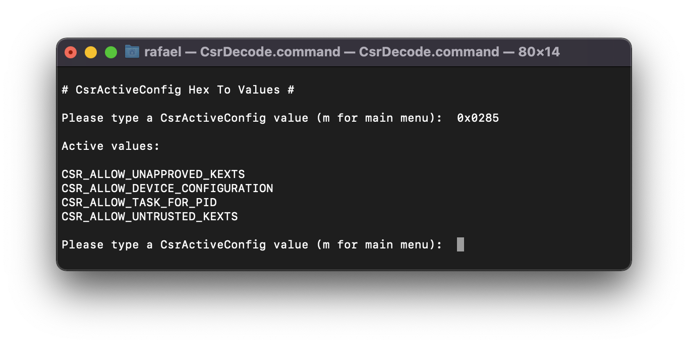

# Install VoodooHDA.kext in macOS Monterey

Guide created with [yahgoo/installVoodooHDA4BSnMont](https://github.com/yahgoo/installVoodooHDA4BSnMont) and [corpnewt/CsrDecode](https://github.com/corpnewt/CsrDecode).

  1. In OpenCore Configurator go to `NVRAM` -> `csr-active-config` and set

      | Key*              | Value    | Type   |
      | ----------------- | -------- | ------ |
      | csr-active-config | `0x0285` | STRING |

      

  2. Boot into recovery mode, open up terminal, disable SIP with `csrutil` and `authenticated-root`, reboot afterwards

      ```sh
      csrutil disable
      csrutil authenticated-root disable
      reboot
      ```

      Check `SIP` status after reboot (should both be `disabled`)

      ```sh
      csrutil status
      > System Integrity Protection status: disabled (Apple Internal).

      csrutil authenticated-root status
      > Authenticated Root status: disabled
      ```

  3. Check label for `Montery` volume (might be `disk1s5`)

      ```sh
      diskutil list
      ```

      Mount System-Snapshot of `Montery` volume by label

      ```sh
      sudo diskutil mountdisk disk1s5
      > Volume(s) mounted successfully
      ```

  4. Disable `GateKeeper` and verify status (should be `disabled`)

      ```sh
      sudo spctl --master-disable

      spctl --status
      > assessments disabled
      ```

  5. Copy `VoodooHDA.kext` to `L/E`

      ```sh
      sudo cp -R /VoodooHDA.kext /Library/Extensions
      ```

  6. Wait for prompt `System Extension Updated` and accept it. Open System Preferences and allow kext modification, **don't reboot**.
  7. Open `Hackintool` -> `Utilities` -> `Rebuild KectCache and Repair Permissions`, enter password and accept mounting in read/write mode.
  8. Seal Volume and create a new snapshot (check if the mount point equals `/Volumes/Monterey\ 1/` e.g. with `diskutil apfs list`)

      ```sh
      sudo bless --folder /Volumes/Monterey\ 1/System/Library/CoreServices --bootefi --create-snapshot
      ```

  9.  Reboot and check if audio device is working as expected.
  10. Revert all changes (keep `csr-active-config`):

        Re-Enable `GateKeeper` and verify status (should be `enabled`)

        ```sh
        sudo spctl --master-enable

        spctl --status
        > assessments enabled
        ```

        Re-Enable `SIP` after booting in recovery mode

        ```sh
        csrutil authenticated-root enable
        csrutil enable
        reboot
        ```

        Check `SIP` status after reboot (should both be `enabled`)

        ```sh
        csrutil status
        > System Integrity Protection status: enabled (Apple Internal).

        csrutil authenticated-root status
        > Authenticated Root status: enabled
        ```

  11. Enjoy Audio :)

## Links

- [(Snapshot sealed: broken) Reparatur Möglichkeit](https://www.hackintosh-forum.de/forum/thread/53293-snapshot-sealed-broken-reparatur-m%C3%B6glichkeit/?postID=686967#post686967)
- [Big Sur’s Signed System Volume: added security protection](https://eclecticlight.co/2020/06/25/big-surs-signed-system-volume-added-security-protection/)
- [Why you can’t make a snapshot of Big Sur’s System volume to roll back
](https://eclecticlight.co/2021/06/11/why-you-cant-make-a-snapshot-of-big-surs-system-volume-to-roll-back/)
- [OpenCore and macOS 11: Big Sur - Broken Seal](https://dortania.github.io/OpenCore-Install-Guide/extras/big-sur/#broken-seal)
