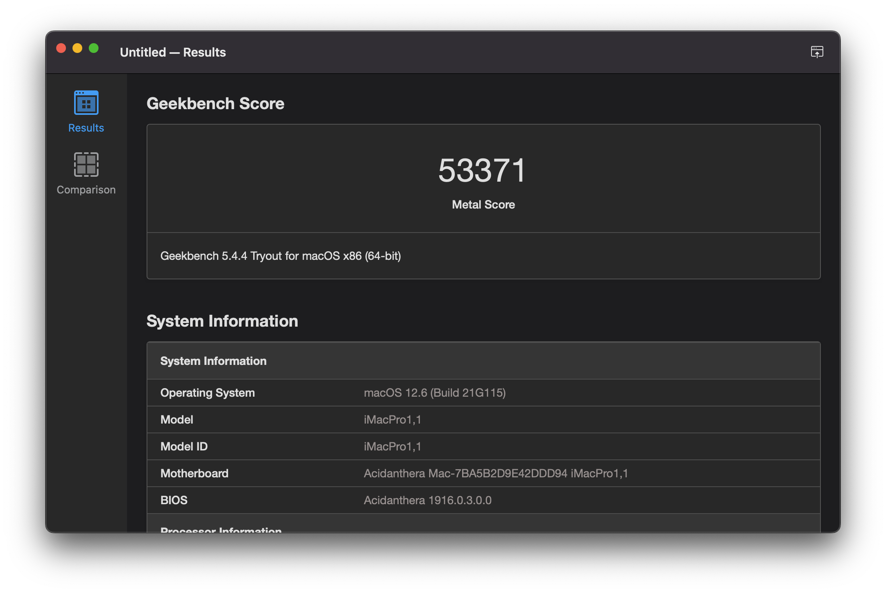

## ASUS PRIME Z590-P Hackintosh

Install macOS Monterey on ASUS PRIME Z590-P Gaming Mainboard with 11th Gen Intel CPU.


### Information

This Hackintosh was created with help of some motivating projects like [SchmockLord/Gigabyte-Z590i-Vision-D-11900k](https://github.com/SchmockLord/Gigabyte-Z590i-Vision-D-11900k) and the OpenCore guide [Desktop Comet Lake](https://dortania.github.io/OpenCore-Install-Guide/config.plist/comet-lake.html) as base.

- macOS: [Monterey 12.6.1](https://support.apple.com/en-us/HT212585)
- bootloader: [OpenCore 0.8.5](https://github.com/acidanthera/OpenCorePkg/releases/tag/0.8.5)

<a href="https://www.buymeacoffee.com/rafaelmaeuer"></a>

---

**Table of Contents**

- [ASUS PRIME Z590-P Hackintosh](#asus-prime-z590-p-hackintosh)
  - [Information](#information)
    - [Hardware](#hardware)
    - [Performance](#performance)
  - [Install macOS](#install-macos)
    - [1. Installer-Drive](#1-installer-drive)
    - [2. BIOS Settings](#2-bios-settings)
    - [3. Install macOS](#3-install-macos)
    - [4. Post Install](#4-post-install)
  - [Update macOS](#update-macos)
  - [DualBoot Windows](#dualboot-windows)
  - [Resources](#resources)
    - [Boot Flags](#boot-flags)
    - [ACPI Patches](#acpi-patches)
    - [Kexts](#kexts)
    - [Tools](#tools)
    - [Troubleshooting](#troubleshooting)
  - [Credits and Documentation](#credits-and-documentation)

---

#### Hardware

| Component    | Variant                                  | Info                                                                                                                                                                                                   | Buy                                                                                                        |
| ------------ | ---------------------------------------- | ------------------------------------------------------------------------------------------------------------------------------------------------------------------------------------------------------ | ---------------------------------------------------------------------------------------------------------- |
| Mainboard    | ASUS PRIME Z590-P                        | [asus.com](https://www.asus.com/Motherboards-Components/Motherboards/PRIME/PRIME-Z590-P-CSM/)                                                                                                          | [amazon.de](https://re-link.info/hackintosh/i7-11700K)                                                     |
| Processor    | Intel Core i7 11700K                     | [ark.intel.com](https://ark.intel.com/content/www/us/en/ark/products/212047/intel-core-i711700k-processor-16m-cache-up-to-5-00-ghz.html)                                                               | [amazon.de](https://re-link.info/hackintosh/i7-11700K)                                                     |
| DDR4 RAM     | Crucial Ballistix 32GB                   | [crucial.com](https://www.crucial.com/memory/ddr4/bl2k16g32c16u4b)                                                                                                                                     | [amazon.de](https://re-link.info/hackintosh/ballistix)                                                     |
| NVMe SSD     | Samsung 980 Pro 1TB                      | [samsung.com](https://www.samsung.com/us/computing/memory-storage/solid-state-drives/980-pro-pcie-4-0-nvme-ssd-1tb-mz-v8p1t0b-am/)                                                                     | [amazon.de](https://re-link.info/hackintosh/980Pro)                                                        |
| Graphics     | ROG Strix RX570 4G <br> PULSE RX 580 8GB | [rog.asus.com](https://rog.asus.com/graphics-cards/graphics-cards/rog-strix/rog-strix-rx570-o4g-gaming-model/) <br> [sapphiretech.com](https://www.sapphiretech.com/de-de/consumer/pulse-rx-580-8g-g5) | [amazon.de](https://re-link.info/hackintosh/rx570) <br> [amazon.de](https://re-link.info/hackintosh/rx580) |
| WiFi / BT    | Fenvi FV T919 PCI-E                      | [fenvi.com](https://www.fenvi.com/product_detail_16.html)                                                                                                                                              | [amazon.de](https://re-link.info/hackintosh/T919)                                                          |
| SATA / eSata | DIGITUS DS-30104-1                       | [digitus.info](https://www.digitus.info/de/produkte/computer-und-office-zubehoer/computer-zubehoer/io-karten/ds-30104-1/?PL=en)                                                                        | [amazon.de](https://re-link.info/hackintosh/digitus)                                                       |

#### Performance

Geekbench 5 Score of Intel Core i7 11700K CPU


Geekbench 5 Score (Metal) of Radeon RX 580 GPU


Blackmagic Disk Speed of Samsung Pro 980 NVMe SSD


---

### Install macOS

#### 1. Installer-Drive

**a) macOS Installer**

To create a working macOS Installer-Drive, you need the following:

- An empty USB flash drive (minimum 16GB)
- A device already running macOS with App Store access

**a) macOS Installer**

- Open the Mac App Store on a device running macOS
- Download `Install macOS Monterey` application
- Close Installer when it opens up automatically
- Follow this guide: [How to Create a Bootable macOS Monterey Installer](https://mrmacintosh.com/how-to-create-a-bootable-macos-12-beta-usb-drive-in-5-min/)
  
  or create Installer-Drive with this command:

  ```sh
  sudo /Applications/Install\ macOS\ Monterey.app/Contents/Resources/createinstallmedia --volume /Volumes/USB
  ```

**b) OpenCore**

- Download latest OpenCore: [acidanthera/opencorepkg](https://github.com/acidanthera/opencorepkg/releases)
  - Chose `debug` for installation and testing or `release` for final use
- Mount `EFI` partition of Installer-Drive (e.g. with OpenCore Configurator)
- Follow this guide [OpenCore-Install-Guide](https://dortania.github.io/OpenCore-Install-Guide/installer-guide/)
  - Basically the files mentioned in [file-swaps](https://dortania.github.io/OpenCore-Install-Guide/troubleshooting/debug.html#file-swaps) need to be copied/updated
    - Add `OpenCanopy.efi` to `EFI/OC/Drivers` for GUI picker
    - Add `OpenHfsPlus.efi` to `EFI/OC/Drivers` for HFS+ support
  - Repeat this step when switching from `debug` to `release` version

**c) Patches and Kexts**

- Copy all ACPI patches from/to `EFI/OC/ACPI/`
- Copy `config.plist` from/to `EFI/OC/config.plist`
- Copy all kexts from/to `EFI/OC/Kexts/`

---

#### 2. BIOS Settings

- Update to version 1601 (firmware in [BIOS](/BIOS) folder)
- Use following BIOS settings (DEL/F2 on boot):

  EZ-Mode
  
  ```sh
  EZ System Tuning
    - ASUS Extreme Tuning
  ```

  Advanced Mode (F7)

  ```sh
  Ai Tweaker
    - Ai Overclock Tuner: XMP I
  Advanced
    - CPU Configuration
      - Intel (VMX) Virtualization Technology: Enabled
    - System Agent (SA)-Configuration
      - Graphics Configuration
        - iGPU Multi-Monitor: Disabled
    - PCH Storage Configuration
      - SATA6G_(1-4) Hot Plug: Enabled
    - Thunderbolt(TM) Configuration
      - Discrete Thunderbolt(TM) Support: Disabled
    - PCI Subsystem Settings
      - Above 4G Decoding: Enabled
    - USB Configuration
      - Legacy USB Support: Enabled
      - XHCI Hand-off: Enabled
    - Onboard Devices Configuration
      - Serial Port Configuration
        - Serial Port: Disabled
  Boot
    - CSM (Compatibility Support Module)
      - Launch CSM: Disabled
    - Secure Boot
      - OS Type: Windows UEFI mode
      - Key Management
        - Clear Secure Boot Keys: Execute
    - Boot Configuration
      - Fast Boot: Disabled
      - POST Delay Time: 0 sec
      - Wait For 'F1' If Error: Disabled
  Tool
    - ASUS Armoury Crate
      - Download & Install ARMOURY CRATE app: Disabled
  ```

---

#### 3. Install macOS

- ⚠️ Connect Installer-Drive to **USB2** port ⚠️
- Boot from Installer-Drive (`F8` on BIOS post -> `[UEFI] USB Drive`)
- Select macOS Installer (`Install macOS Monterey`)
- Begin installation on APFS formatted SSD
- Finish the initial macOS setup process

---

#### 4. Post Install

**a) OpenCore**

- After successful install copy OpenCore to system EFI partition
- Repeat steps 1b + 1c but with EFI of macOS SSD as target
  - Switch OpenCore from `debug` to `release` version ([file-swaps](https://dortania.github.io/OpenCore-Install-Guide/troubleshooting/debug.html#file-swaps))
  - To disable all logging apply following [config-changes](https://dortania.github.io/OpenCore-Install-Guide/troubleshooting/debug.html#config-changes)

**b) Sleep/Wake**

- Read and follow instructions in [Docs/SLEEP](Docs/SLEEP.md).

**c) Tools**

- Install the following from [Tools](/Tools) folder:
  - `OpenCore Configurator` (OCC) to modify/update `config.plist`
  - `Hackintool` to check loaded kexts, system settings and more

**d) Security**

- Use [SilentKnight](https://eclecticlight.co/lockrattler-systhist/) to check security state and update missing software or tools.

**e) Audio**

- (Optional) Install VoodooHDA by following instructions in [Docs/AUDIO](Docs/AUDIO.md).

---

### Update macOS

Check the official update-guide: [OpenCore-Post-Install/update](https://dortania.github.io/OpenCore-Post-Install/universal/update.html)

1. Backup
   - Full system backup with `Time Machine` or similar software
   - Copy current EFI to OpenCore USB-Drive for recovery purpose
2. Download
   - Latest version of OpenCore and replace files in EFI
   - Updates for all installed kexts and replace in EFI
3. Reboot
   - Boot with updated OpenCore version and kexts
   - If the system doesn't boot, use OpenCore USB-Drive to roll back
4. Update
   - Start macOS Update from `System Settings` -> `Software Update`
   - With OpenCore the update process should work automatically
   - If `Software Update` shows `Mac version is up to date`, download macOS Installer from AppStore and start the update manually

If the system doesn't boot, try to fix the problem or revert to the latest EFI or system-backup.

---

### DualBoot Windows

1. Install
   - Create new partition (~106 GB min) with `disk utility`
   - Create a Windows 11 Installer with [Rufus](https://rufus.ie/) (TPM 2.0 + Secure-Boot)
   - Select `Windows` boot entry in OpenCanopy to begin installation
   - Delete the partition from installer and let Windows re-create it

2. Drivers
   - Use the `Z590-P Driver-DVD` to install all missing drivers
   - Unzip drivers in [Windows/Driver](Windows/Driver/) folder and install manually from Device-Manager (`Broadcom BT/WiFi` and `Marvel Console`)
   - For Magic Mouse scrolling install `AppleWirelessMouse64.exe` from [Windows/Mouse](Windows/Mouse/) folder

3. Fixes
   - For Scroll-Inversion follow the instructions from [windowscentral.com](https://www.windowscentral.com/how-reverse-scrolling-direction-windows-10)
   - For Keyboard remapping use [AutoHotkey](https://www.autohotkey.com/) and [SharpKeys](https://github.com/randyrants/sharpkeys) with proper config files from [Windows/Keyboard](Windows/Keyboard/) folder
   - Fix incorrect clock settings by instructions from [lifehacker.com](https://lifehacker.com/fix-incorrect-clock-settings-in-windows-when-dual-booti-5742148)
   - Currently there are two concurrent problems:
     - Don't install BT-Driver in Windows: Mouse works on both OS while restart, but no Scroll in Windows
     - Install BT-Driver in Windows: Scrolling in Windows works, but restart breaks connection for other OS

---

### Resources

Basic information to run this Hackintosh. For more detailed information see [Docs/CONFIG](Docs/CONFIG.md).

#### Boot Flags

The following bootflags are used:

- [alcid=11](https://github.com/acidanthera/AppleALC/blob/master/Resources/ALC897/Info.plist) for ALC897 audio config
- [darkwake=0](https://dortania.github.io/OpenCore-Post-Install/usb/misc/keyboard.html#method-3-configuring-darkwake) fixes `Wake by RTC/Maintenance`

#### ACPI Patches

Several SSDT patches are [recommended](https://dortania.github.io/Getting-Started-With-ACPI/ssdt-methods/ssdt-prebuilt.html#desktop-comet-lake) by dortania (generated with [SSDTTime](https://github.com/corpnewt/SSDTTime)):

| Patch                   | Name               | Link                                                                                                                                |
| ----------------------- | ------------------ | ----------------------------------------------------------------------------------------------------------------------------------- |
| Fix System Clock        | SSDT-AWAC.aml      | [dortania/acpi/awac-methods](https://dortania.github.io/Getting-Started-With-ACPI/Universal/awac-methods/prebuilt.html)             |
| Fix Embedded Controller | SSDT-EC.aml        | [dortania/acpi/ec-fix](https://dortania.github.io/Getting-Started-With-ACPI/Universal/ec-fix.html)                                  |
| Fix Power Management    | SSDT-PLUG.aml      | [dortania/acpi/plug](https://dortania.github.io/Getting-Started-With-ACPI/Universal/plug.html)                                      |
| Fix USB RHUB            | SSDT-USB-Reset.aml | [dortania/acpi/rhub-methods](https://dortania.github.io/Getting-Started-With-ACPI/Universal/rhub-methods/ssdttime.html)             |
| Fix USB Keyboard Wake   | SSDT-USBW.aml      | [dortania/usb/keyboard](https://dortania.github.io/OpenCore-Post-Install/usb/misc/keyboard.html#method-2-create-a-fake-acpi-device) |

---

#### Kexts

| Type            | Kext                                                         | Version          | Author                                                                                                                              |
| --------------- | ------------------------------------------------------------ | ---------------- | ----------------------------------------------------------------------------------------------------------------------------------- |
| Audio           | AppleALC /<br> VodooHDA.kext*                                | 1.7.5 <br> 2.9.9 | [acidanthera/AppleALC](https://github.com/acidanthera/AppleALC) <br> [sourceforge.net](https://sourceforge.net/projects/voodoohda/) |
| Card Reader     | GenericCardReaderFriend.kext                                 | 1.0.1            | [0xFireWolf/GenericCardReaderFriend](https://github.com/0xFireWolf/GenericCardReaderFriend)                                         |
| CMOS Memory     | RTCMemoryFixup.kext                                          | 1.0.7            | [acidanthera/RTCMemoryFixup](https://github.com/acidanthera/RTCMemoryFixup)                                                         |
| CPU Temp        | XHCI-unsupported.kext                                        | 0.9.2            | [RehabMan/OS-X-USB-Inject-All](https://github.com/RehabMan/OS-X-USB-Inject-All/tree/master/XHCI-unsupported.kext)                   |
| Ethernet        | LucyRTL8125Ethernet.kext                                     | 1.1.0            | [Mieze/LucyRTL8125Ethernet](https://github.com/Mieze/LucyRTL8125Ethernet)                                                           |
| Graphics        | WhateverGreen.kext                                           | 1.6.1            | [acidanthera/WhateverGreen](https://github.com/acidanthera/WhateverGreen)                                                           |
| NVMe SSD        | NVMeFix.kext                                                 | 1.1.0            | [acidanthera/NVMeFix](https://github.com/acidanthera/NVMeFix)                                                                       |
| Patch Engine    | Lilu.kext                                                    | 1.6.2            | [acidanthera/Lilu](https://github.com/acidanthera/Lilu)                                                                             |
| Sensors         | VirtualSMC.kext <br> SMCSuperIO.kext <br>  SMCProcessor.kext | 1.3.0            | [acidanthera/VirtualSMC](https://github.com/acidanthera/VirtualSMC)                                                                 |
| USB Map         | USBMap.kext                                                  | 1.0              | [rafaelmaeuer/Z590-P/USB](https://github.com/rafaelmaeuer/Asus-Z590-P-Hackintosh/tree/master/USB/Results/USBMap.kext)               |
| (USB Map Helper | USBInjectAll.kext                                            | 0.7.6            | [Sniki/OS-X-USB-Inject-All](https://github.com/Sniki/OS-X-USB-Inject-All))                                                          |
| USB Wake        | USBWakeFixup.kext                                            | 1.0              | [osy/USBWakeFixup](https://github.com/osy/USBWakeFixup)                                                                             |

*\*Kext needs special setup, see [Docs/AUDIO](Docs/AUDIO.md)*

---

#### Tools

| Name                   | Version   | Download                                                                                                    |
| ---------------------- | --------- | ----------------------------------------------------------------------------------------------------------- |
| Hackintool             | 3.8.7     | [headkaze/Hackintool](https://github.com/headkaze/Hackintool/)                                              |
| ~~Intel Power Gadget~~ | 3.7.0*  🚨 | [software.intel.com](https://software.intel.com/content/www/us/en/develop/articles/intel-power-gadget.html) |
| IORegistryExplorer     | 2.1       | [vulgo/IORegistryExplorer](https://github.com/vulgo/IORegistryExplorer)                                     |
| MaciASL                | 1.6.2     | [acidanthera/MaciASL](https://github.com/acidanthera/MaciASL/)                                              |
| OpenCore Configurator  | 2.63.0.0  | [mackie100projects](https://mackie100projects.altervista.org/download-opencore-configurator/)               |
| USBMap                 | -         | [corpnewt/USBMap](https://github.com/corpnewt/USBMap)                                                       |

*\*This version causes kernel panic after sleep on iMacPro1,1 SMBIOS*

---

#### Troubleshooting

For a list of tips and tricks for already known problems see [docs/TROUBLE](docs/TROUBLE.md).

---

### Credits and Documentation

This Hackintosh was build with help of the following repositories and guides:

| Help on Issue                    | Source                                                                                                                        |
| -------------------------------- | ----------------------------------------------------------------------------------------------------------------------------- |
| Motivation and Hardware          | [SchmockLord/Gigabyte-Z590i-Vision-D-11900k](https://github.com/SchmockLord/Gigabyte-Z590i-Vision-D-11900k)                   |
| BIOS and OpenCore Config         | [yilmazca/intel-i9-10900K-Asus-prime-Z490A](https://github.com/yilmazca/intel-i9-10900K-Asus-prime-Z490A-hackintosh)          |
| F1 Boot Error and BIOS           | [jergoo/Hackintosh-ROG-STRIX-Z490I](https://github.com/jergoo/Hackintosh-ROG-STRIX-Z490I#f1-boot-error)                       |
| OpenCore Config and Installation | [OpenCore Install Guide - Desktop Comet Lake](https://dortania.github.io/OpenCore-Install-Guide/config.plist/comet-lake.html) |
| Installing VoodooHDA             | [yahgoo/installVoodooHDA4BSnMont](https://github.com/yahgoo/installVoodooHDA4BSnMont)                                         |
| Layout for AppleALC              | Mikaël G.                                                                                                                     |

Find more links and documentation in [Docs/LINKS](Docs/LINKS.md).
