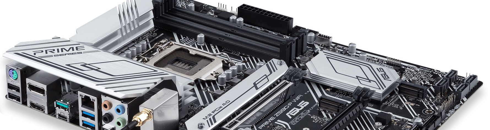
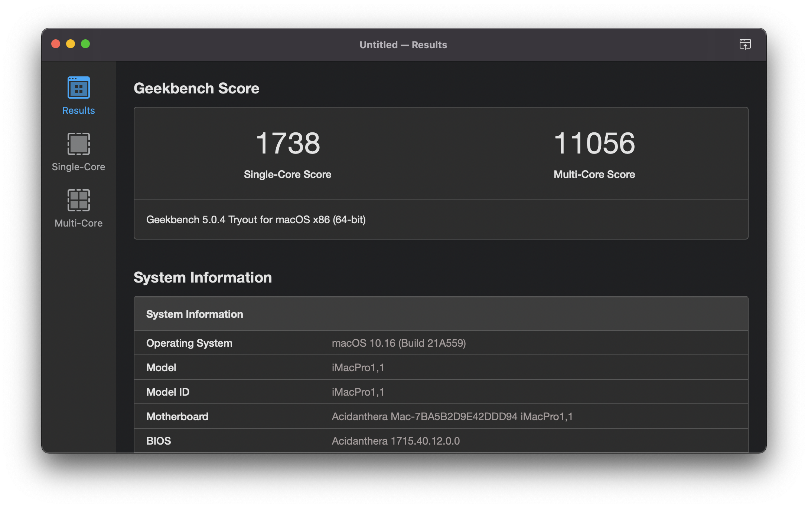
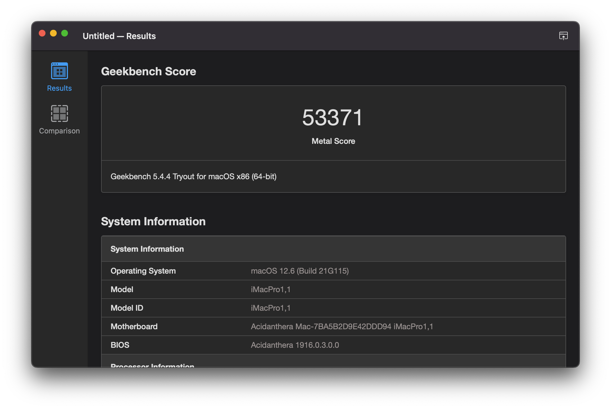
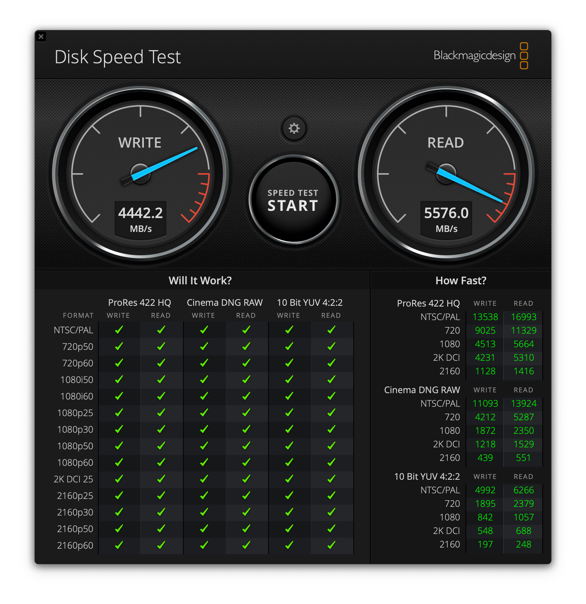

## ASUS PRIME Z590-P Hackintosh

Install macOS Monterey on ASUS PRIME Z590-P Gaming Mainboard with 11th Gen Intel CPU.



### Information

This Hackintosh was created with help of some motivating projects like [SchmockLord/Gigabyte-Z590i-Vision-D-11900k](https://github.com/SchmockLord/Gigabyte-Z590i-Vision-D-11900k) and the OpenCore guide [Desktop Comet Lake](https://dortania.github.io/OpenCore-Install-Guide/config.plist/comet-lake.html) as base.

- macOS: [Monterey 12.3.1](https://support.apple.com/en-us/HT212585)
- bootloader: [OpenCore 0.7.9](https://github.com/acidanthera/OpenCorePkg/releases/tag/0.7.9)

<a href="https://www.buymeacoffee.com/rafaelmaeuer"></a>

---

**Table of Contents**

- [ASUS PRIME Z590-P Hackintosh](#asus-prime-z590-p-hackintosh)
  - [Information](#information)
    - [Hardware](#hardware)
    - [Performance](#performance)
  - [Install macOS](#install-macos)
    - [1. OpenCore Drive](#1-opencore-drive)
    - [2. macOS Installer](#2-macos-installer)
    - [3. BIOS Settings](#3-bios-settings)
    - [4. Install macOS](#4-install-macos)
    - [5. Post Install](#5-post-install)
  - [Update macOS](#update-macos)
  - [DualBoot Windows](#dualboot-windows)
  - [Resources](#resources)
    - [OpenCore Config](#opencore-config)
    - [ACPI Patches](#acpi-patches)
    - [Advanced Config](#advanced-config)
    - [Kexts in use](#kexts-in-use)
    - [Tools](#tools)
  - [Troubleshooting](#troubleshooting)
  - [Credits](#credits)
    - [Links and Documentation](#links-and-documentation)

---

#### Hardware

| Component    | Variant                | Link                                                                                                                                     |
| ------------ | ---------------------- | ---------------------------------------------------------------------------------------------------------------------------------------- |
| Mainboard    | ASUS PRIME Z590-P      | [www.asus.com](https://www.asus.com/Motherboards-Components/Motherboards/PRIME/PRIME-Z590-P-CSM/)                                        |
| Processor    | Intel Core i7 11700K   | [ark.intel.com](https://ark.intel.com/content/www/us/en/ark/products/212047/intel-core-i711700k-processor-16m-cache-up-to-5-00-ghz.html) |
| DDR4 RAM     | Crucial Ballistix 32GB | [www.crucial.com](https://www.crucial.com/memory/ddr4/bl2k16g32c16u4b)                                                                   |
| NVMe SSD     | Samsung 980 Pro 1TB    | [www.samsung.com](https://www.samsung.com/us/computing/memory-storage/solid-state-drives/980-pro-pcie-4-0-nvme-ssd-1tb-mz-v8p1t0b-am/)   |
| Graphics     | ROG Strix RX570 4G     | [rog.asus.com](https://rog.asus.com/graphics-cards/graphics-cards/rog-strix/rog-strix-rx570-o4g-gaming-model/)                           |
| WiFi / BT    | Fenvi FV T919 PCI-E    | [www.fenvi.com](https://www.fenvi.com/product_detail_16.html)                                                                            |
| SATA / eSata | DIGITUS DS-30104-1     | [www.digitus.info](https://www.digitus.info/de/produkte/computer-und-office-zubehoer/computer-zubehoer/io-karten/ds-30104-1/?PL=en)      |

#### Performance

Geekbench 5 Score of Intel Core i7 11700K CPU


Geekbench 5 Score (Metal) of Radeon RX 570 GPU


Blackmagic Disk Speed of Samsung Pro 980 NVMe SSD


---

### Install macOS

#### 1. OpenCore Drive

**a) Preparation**

- Format USB-Drive with GUID and APFS ([Link](https://www.howtogeek.com/272741/how-to-format-a-drive-with-the-apfs-file-system-on-macos-sierra/))

  - Find the correct disk number of USB-Drive:

    ```sh
    diskutil list
    ```

  - Replace {n} with corresponding disk number and {Volume} with desired Name:

    ```sh
    diskutil apfs createContainer /dev/disk{n}
    diskutil apfs addVolume disk{n} APFS {Volume}
    ```

- Download latest OpenCore: [acidanthera/opencorepkg](https://github.com/acidanthera/opencorepkg/releases)
  - Chose `debug` for installation and build or `release` for final use

**b) Install OpenCore**

- Follow this guide [OpenCore-Install-Guide](https://dortania.github.io/OpenCore-Install-Guide/installer-guide/)
  - Basically the files mentioned in [file-swaps](https://dortania.github.io/OpenCore-Install-Guide/troubleshooting/debug.html#file-swaps) need to be copied/updated
    - Copy `OpenCanopy.efi` to `EFI/OC/Drivers` for GUI picker
    - Copy `OpenHfsPlus.efi` to `EFI/OC/Drivers` for HFS+ support
  - Repeat this step when switching from `debug` to `release` version

**c) Add Config and Kexts**

- Copy all ACPI patches from/to `EFI/OC/ACPI/`
- Copy `config.plist` from/to `EFI/OC/config.plist`
- Copy all kexts from/to `EFI/OC/Kexts/`

---

#### 2. macOS Installer

To create a working macOS Installer boot drive, you will need the following:

- An empty USB flash drive (minimum 16GB)
- A device already running macOS with App Store access

**a) Download macOS Installer**

- Open the Mac App Store on a device running macOS
- Download `Install macOS Monterey` application
- Close Installer when it opens up automatically

**b) Create Installer Stick**

- Follow this guide: [How to Create a Bootable macOS Monterey Installer](https://mrmacintosh.com/how-to-create-a-bootable-macos-12-beta-usb-drive-in-5-min/)
  
  or create installer stick with this command:

  ```sh
  sudo /Applications/Install\ macOS\ Monterey.app/Contents/Resources/createinstallmedia --volume /Volumes/USB
  ```

---

#### 3. BIOS Settings

- Update to version 1017 (firmware in [BIOS](/BIOS) folder)
- Use following BIOS settings (DEL/F2 on boot):

  ```sh
  Ai Tweaker
    - Ai Overclock Tuner: XMP I
    - OC Tuner: OC Tuner II
  Advanced
    - CPU Configuration
      - Intel (VMX) Virtualization Technology: Enabled
    - System Agent (SA)-Configuration
      - Graphics Configuration
        - iGPU Multi-Monitor: Disabled
    - PCH Storage Configuration
      - SATA6G_(1-4) Hot Plug: Enabled
    - Thunderbolt(TM) Configuration
      - Discrete Thunderbolt(TM) Support: Disabled
    - PCI Subsystem Settings
      - Above 4G Decoding: Enabled
    - USB Configuration
      - Legacy USB Support: Enabled
      - XHCI Hand-off: Enabled
    - Onboard Devices Configuration
      - Serial Port Configuration
        - Serial Port: Disabled
  Boot
    - CSM (Compatibility Support Module)
      - Launch CSM: Disabled
    - Secure Boot
      - OS Type: Windows UEFI mode
      - Key Management
        - Clear Secure Boot Keys: Execute
    - Boot Configuration
      - Fast Boot: Disabled
  ```

---

#### 4. Install macOS

- Connect OpenCore Drive to USB2 or USB3 port
- ⚠️ Connect macOS Installer to **USB2** port ⚠️
- Boot from OpenCore Drive (`F8` on BIOS post -> `[UEFI] OpenCore Drive`)
- Select macOS Installer (`Install macOS Monterey`)
- Begin installation on APFS formatted HDD/SSD
- On reboots select `(Install) Monterey` drive (auto)
- Finish the onboarding macOS setup process

---

#### 5. Post Install

**a) OpenCore**

- After successful install copy OpenCore to system EFI partition
- Repeat steps 1b - 1c but with EFI on macOS HDD as target
  - Switch OpenCore from `debug` to `release` version ([file-swaps](https://dortania.github.io/OpenCore-Install-Guide/troubleshooting/debug.html#file-swaps))
  - To disable all logging apply following [config-changes](https://dortania.github.io/OpenCore-Install-Guide/troubleshooting/debug.html#config-changes)

**b) System-Tools**

- Install the following from [Tools](/Tools) folder:
  - `OpenCore Configurator` (OCC) to modify/update `config.plist`
  - `Hackintool` to check loaded kexts, system settings and more

**c) Drivers/Kexts**

- (Optional) Install VoodooHDA by following instructions in [Docs/AUDIO.md](Docs/AUDIO.md).

**d) Security**

- Use [SilentKnight](https://eclecticlight.co/lockrattler-systhist/) to check security state and update missing software or tools.

---

### Update macOS

- Make a full backup with `Time Machine` or similar software
- Check the official update-guide: [OpenCore-Post-Install/update](https://dortania.github.io/OpenCore-Post-Install/universal/update.html)
- Download latest version of OpenCore
- Download updates for all installed kexts
- Update OpenCore Drive for testing purpose
  - Use latest OpenCore, kexts and drivers
- Boot from OpenCore Drive
- If the system boots
  - Mount EFI partition of macOS HDD
  - Replace EFI from OpenCore Drive
- If the system boots
  - Start macOS Update from `System Settings` -> `Software Update`
  - With OpenCore the update process should work automatically
    - If `Software Update` shows `Mac version is up to date`, download macOS Installer from AppStore and initialize the update manually
- If system doesn't boot on one of these steps
  - Try to fix the problem or revert to the latest backup

---

### DualBoot Windows

- Create new partition (~106 GB min) with `disk utility`
- Create a Windows 11 Installer with [Rufus](https://rufus.ie/) (TPM 2.0 + Secure-Boot)
- Select `Windows` boot entry in OpenCanopy to begin installation
- Delete the partition from installer and let Windows re-create it
- Use the `Z590-P Driver-DVD` to install all missing drivers
- Unzip drivers in [Windows/Driver](Windows/Driver/) folder and install manually from Device-Manager (`Broadcom BT/WiFi` and `Marvel Console`)
- For Magic Mouse scrolling install `AppleWirelessMouse64.exe` from [Windows/Mouse](Windows/Mouse/) folder
- For Scroll-Inversion follow the instructions from [windowscentral.com](https://www.windowscentral.com/how-reverse-scrolling-direction-windows-10)
- For Keyboard remapping use [AutoHotkey](https://www.autohotkey.com/) and [SharpKeys](https://github.com/randyrants/sharpkeys) with proper config files from [Windows/Keyboard](Windows/Keyboard/) folder
- Fix incorrect clock settings by instructions from [lifehacker.com](https://lifehacker.com/fix-incorrect-clock-settings-in-windows-when-dual-booti-5742148)
- Currently there are two concurrent problems:
  - Don't install BT-Driver in Windows: Mouse works on both OS while restart, but no Scroll in Windows
  - Install BT-Driver in Windows: Scrolling in Windows works, but restart breaks connection for other OS

---

### Resources

Useful information, tips and tutorials used to create this Hackintosh.

#### OpenCore Config

When [adding SSDTs, Kexts and Firmware Drivers](https://dortania.github.io/OpenCore-Install-Guide/config.plist/#adding-your-ssdts-kexts-and-firmware-drivers) to the EFI folder, use [OpenCore Configurator](https://mackie100projects.altervista.org/opencore-configurator/) as GUI or [corpnewt/ProperTree](https://github.com/corpnewt/ProperTree) when needing an universal plist-editor.

**Add kexts**

To manually add kexts:

- Copy `{name}.kext` into `EFI/OC/Kexts`
- Open `config.plist` in OpenCore Configurator
- Add new files with `Kernel` -> `Scan/Browse`
  - Select `EFI/OC/Kexts` folder
  - Add a meaningful `Comment` to kext
  - (Optional: set `MinKernel` and `MaxKernel`)

**Add ACPI patches**

To manually add ACPI patches:

- Copy `{name}.aml` into `EFI/OC/ACPI`
- Open `config.plist` in OpenCore Configurator
- Add new files with `ACPI` -> `Scan/Browse`
  - Select `EFI/OC/ACPI` folder
  - Add a meaningful `Comment` to SSDT

#### ACPI Patches

Several SSDT patches are [recommended](https://dortania.github.io/Getting-Started-With-ACPI/ssdt-methods/ssdt-prebuilt.html#desktop-comet-lake) by dortania (generated with [SSDTTime](https://github.com/corpnewt/SSDTTime)):

| Problem                  | Patch              | Link                                                                                                                    |
| ------------------------ | ------------------ | ----------------------------------------------------------------------------------------------------------------------- |
| Fix System Clocks        | SSDT-AWAC.aml      | [dortania/acpi/awac-methods](https://dortania.github.io/Getting-Started-With-ACPI/Universal/awac-methods/prebuilt.html) |
| Fix Embedded Controllers | SSDT-EC.aml        | [dortania/acpi/ec-fix](https://dortania.github.io/Getting-Started-With-ACPI/Universal/ec-fix.html)                      |
| Fix Power Management     | SSDT-PLUG.aml      | [dortania/acpi/plug](https://dortania.github.io/Getting-Started-With-ACPI/Universal/plug.html)                          |
| Fix USB (Reset RHUB)     | SSDT-USB-Reset.aml | [dortania/acpi/rhub-methods](https://dortania.github.io/Getting-Started-With-ACPI/Universal/rhub-methods/ssdttime.html) |

---

#### Advanced Config

The following configurations are not essential for the Hackintosh to work, but they improve functionality to get as close to a real Mac as possible.

**CPU Config**

In OpenCore Configurator go to `Kernel` -> `Add` and set

| Emulate    |                                       |
| ---------- | ------------------------------------- |
| Cpuid1Data | `EB060900 00000000 00000000 00000000` |
| Cpuid1Mask | `FFFFFFFF 00000000 00000000 00000000` |

**Apple Secure Boot**

In OpenCore Configurator go to `Misc` -> `Security` and set

| Security        |                                   |
| --------------- | --------------------------------- |
| DmgLoading      | `Signed`                          |
| SecureBootModel | `j137 iMacPro1,1 (December 2017)` |

**USB Mapping**

An USB port-mapping can be created with [OpenCore Post-Install - USB Mapping](https://dortania.github.io/OpenCore-Post-Install/usb/intel-mapping/intel.html) guide and [corpnewt/USBMap](https://github.com/corpnewt/USBMap) tool.

- Use Back-Panel USB2-Ports for Mouse and Keyboard
- Use `SSDT-USB-Reset.aml` (or `SSDT-RHUB.aml`) for USB-Reset
- Boot with `USBInjectAll.kext` and &#9745; `XhciPortLimit` enabled
- Run `USBmap.command` and test all ports with USB2/3/C Devices
- Give each port a unique name like e.g. `USB3(HS) Back Left`
- After discovery and naming set the correct port-types
  - USB2: 0
  - USB3: 3
  - USB-C: 9
  - Internal: 255
- Export `USBMap.kext` and add it to EFI and OpenCore
- Disable `XhciPortLimit` and remove `USBInjectAll.kext`

The following generated files can be found in [USB](/USB) folder:

| Path         | File        | Descrition            |
| ------------ | ----------- | --------------------- |
| USB/Results/ | USBMap.kext | USB port-mapping kext |
| USB/Scripts/ | USB.plist   | USB port-naming list  |

**RTC / F1 Error**

If `The system has POSTed in safe mode` error appears after each reboot:

In OpenCore Configurator go to `Kernel` -> `Patch` and add the following [patch](https://github.com/jergoo/Hackintosh-ROG-STRIX-Z490I#f1-boot-error):

| Identifier                | Comment        | Find     | Replace  | Count | Enabled |
| ------------------------- | -------------- | -------- | -------- | ----- | ------- |
| com.apple.driver.AppleRTC | F1 Error Patch | 75330FB7 | EB330FB7 | 1     | &#9745; |

If the error still appears on cold-boots (after power-off), add `RTCMemoryFixup` to your kexts and enable `DisableRtcChecksum` Quirk or try to [find your bad rtc region](https://dortania.github.io/OpenCore-Post-Install/misc/rtc.html#finding-our-bad-rtc-region).

**Bluetooth / Wake**

The internal USB2-ports share the same hub and are used for I/O-Panel and Card-Reader connectors. Therefore an [USB3 to USB2 internal Adapter](https://www.amazon.com/SIENOC-Female-Motherboard-Housing-Adapter/dp/B00EOI3VC8) is used for the Bluetooth-USB connector. [Fixing Sleep Preparations](https://dortania.github.io/OpenCore-Post-Install/universal/sleep.html#preparations) help to fix some connection loss after sleep:

```sh
sudo pmset autopoweroff 0
sudo pmset powernap 0
sudo pmset standby 0
sudo pmset proximitywake 0
sudo pmset tcpkeepalive 0
```

It seems that with Monterey 12.0.1 there are still [issues](https://github.com/acidanthera/bugtracker/issues/1821) with Bluetooth. You can try to enable the `ExtendBTFeatureFlags` Quirk, but otherwise we need to [wait](https://www.tonymacx86.com/threads/bluetooth-doesnt-work-after-wake-on-monterey.315679/#post-2284467) for an update that fixes it.

**Card Reader**

The generic Card-Reader doesn't show up in system preferences by default. Use [Generic Card Reader Driver Friend](https://github.com/0xFireWolf/GenericCardReaderFriend) to display some information. Follow this [guide](https://github.com/0xFireWolf/GenericCardReaderFriend/blob/main/FAQ.md) to find the correct `Product ID` and `Vendor ID` that needs to be set in the kexts `info.plist`.

**SATA Hot-Plug**

To get SATA Hot-Plug working, make sure the feature is enabled in BIOS, and apply the following patch:

| Identifier                     | Comment       | Find     | Replace  | Count | Enabled |
| ------------------------------ | ------------- | -------- | -------- | ----- | ------- |
| com.apple.driver.AppleAHCIPort | SATA Hot Plug | 40600200 | 00000000 | 1     | &#9745; |

If drives are showing up as external, in OpenCore Configurator go to `Kernel` -> `Quirks` and check the `ExternalDiskIcons` Quirk.

**Audio**

The `Audio Codec` of ASUS PRIME Z590-P is [Realtek ALC897](https://www.asus.com/de/Motherboards-Components/Motherboards/PRIME/PRIME-Z590-P/techspec/). Layout-id 11 on `AppleALC` [Supported Codecs](https://github.com/acidanthera/AppleALC/wiki/Supported-codecs) gives basic audio output.

- For AppleHDA add `AppleHDA.kext` and `alcid=11` bootflag

VoodooHDA is also working (requires harder setup) and can be used for advanced audio configuration.

- For VoodooHDA disable `AppleHDA.kext` and `alcid=11` bootflag and follow [Docs/AUDIO.md](Docs/AUDIO.md)

*Note: Every macOS updates requires VoodooHDA to be re-installed again!*

---

#### Kexts in use

| Type         | Kext                                                         | Version          | Author                                                                                                                              |
| ------------ | ------------------------------------------------------------ | ---------------- | ----------------------------------------------------------------------------------------------------------------------------------- |
| Patch Engine | Lilu.kext                                                    | 1.6.0            | [acidanthera/Lilu](https://github.com/acidanthera/Lilu)                                                                             |
| Graphics     | WhateverGreen.kext                                           | 1.5.8            | [acidanthera/WhateverGreen](https://github.com/acidanthera/WhateverGreen)                                                           |
| Sensors      | VirtualSMC.kext <br> SMCSuperIO.kext <br>  SMCProcessor.kext | 1.2.9            | [acidanthera/VirtualSMC](https://github.com/acidanthera/VirtualSMC)                                                                 |
| Audio        | AppleALC <br> VodooHDA.kext*                                 | 1.7.1 <br> 2.9.7 | [acidanthera/AppleALC](https://github.com/acidanthera/AppleALC) <br> [sourceforge.net](https://sourceforge.net/projects/voodoohda/) |
| Ethernet     | IntelMausi.kext                                              | 1.0.7            | [Mieze/LucyRTL8125Ethernet](https://github.com/Mieze/LucyRTL8125Ethernet)                                                           |
| NVMe SSD     | NVMeFix.kext                                                 | 1.0.9            | [acidanthera/NVMeFix](https://github.com/acidanthera/NVMeFix)                                                                       |
| (CMOS Memory | RTCMemoryFixup.kext                                          | 1.0.7            | [acidanthera/RTCMemoryFixup](https://github.com/acidanthera/RTCMemoryFixup))                                                        |
| CPU Temp     | XHCI-unsupported.kext                                        | 0.9.2            | [RehabMan/OS-X-USB-Inject-All](https://github.com/RehabMan/OS-X-USB-Inject-All/tree/master/XHCI-unsupported.kext)                   |
| Card Reader  | GenericCardReaderFriend.kext                                 | 1.0.1            | [0xFireWolf/GenericCardReaderFriend](https://github.com/0xFireWolf/GenericCardReaderFriend)                                         |
| (USB Map     | USBInjectAll.kext                                            | 0.7.6            | [Sniki/OS-X-USB-Inject-All](https://github.com/Sniki/OS-X-USB-Inject-All))                                                          |

*\*Kext needs special setup, see [Docs/AUDIO.md](Docs/AUDIO.md)*

---

#### Tools

| Name                   | Version   | Download                                                                                                    |
| ---------------------- | --------- | ----------------------------------------------------------------------------------------------------------- |
| OpenCore Configurator  | 2.59.0.0  | [mackie100projects](https://mackie100projects.altervista.org/download-opencore-configurator/)               |
| Hackintool             | 3.8.7     | [headkaze/Hackintool](https://github.com/headkaze/Hackintool/)                                              |
| ~~Intel Power Gadget~~ | 3.7.0*  🚨 | [software.intel.com](https://software.intel.com/content/www/us/en/develop/articles/intel-power-gadget.html) |
| IORegistryExplorer     | 2.1       | [vulgo/IORegistryExplorer](https://github.com/vulgo/IORegistryExplorer)                                     |
| MaciASL                | 1.6.2     | [acidanthera/MaciASL](https://github.com/acidanthera/MaciASL/)                                              |
| USBMap                 | -         | [corpnewt/USBMap](https://github.com/corpnewt/USBMap)                                                       |

*\*This version causes kernel panic after sleep on iMacPro1,1 SMBIOS*

---

### Troubleshooting

Tips and tricks to solve already known problems

**Reset NVRAM**

In OpenCore Configurator go to `Misc` -> `Boot` and uncheck the option `HideAuxiliary`.

- On reboot select `Reset NVRAM` from OpenCanopy boot-options

**Default Boot Option**

In OpenCore Configurator go to `Misc` -> `Security` and check the option `AllowSetDefault`.

- In OpenCanopy boot picker set default boot-option with `ctrl + enter`

**Apple Watch Unlock**

If unlock with Apple Watch doesn't work or make problems although using a `BCM94360CD Fenvi` card, follow the steps of this blogpost comment: [watchOS 7 Beta 5 - unlock mac doesn't work](https://forums.macrumors.com/threads/watchos-7-beta-5-unlock-mac-doesnt-work.2250819/page-2?post=28904426#post-28904426). Afterwards unlock with Apple Watch works like a normal Mac.

**Intel Power Gadget**

The latest version of `Intel Power Gadget` (v3.7.0) is causing  kernel panics when waking from sleep when using SMBIOS `iMacPro1,1`. It doesn't happen with `iMac20,2` SMBIOS, but the overall system speed is lower then. So monitoring of CPU frequency and speed stepping is not possible unless a new version of `Intel Power Gadget` will be released.

---

### Credits

This Hackintosh was build with help of the following repositories and guides:

| Help on Issue                    | Source                                                                                                                        |
| -------------------------------- | ----------------------------------------------------------------------------------------------------------------------------- |
| Motivation and Hardware          | [SchmockLord/Gigabyte-Z590i-Vision-D-11900k](https://github.com/SchmockLord/Gigabyte-Z590i-Vision-D-11900k)                   |
| BIOS and OpenCore Config         | [yilmazca/intel-i9-10900K-Asus-prime-Z490A](https://github.com/yilmazca/intel-i9-10900K-Asus-prime-Z490A-hackintosh)          |
| F1 Boot Error and BIOS           | [jergoo/Hackintosh-ROG-STRIX-Z490I](https://github.com/jergoo/Hackintosh-ROG-STRIX-Z490I#f1-boot-error)                       |
| OpenCore Config and Installation | [OpenCore Install Guide - Desktop Comet Lake](https://dortania.github.io/OpenCore-Install-Guide/config.plist/comet-lake.html) |
| Installing VoodooHDA             | [yahgoo/installVoodooHDA4BSnMont](https://github.com/yahgoo/installVoodooHDA4BSnMont)                                         |
| Layout for AppleALC              | Mikaël G.                                                                                                                     |

#### Links and Documentation

Find more information in [Docs/LINKS](Docs/LINKS.md).
